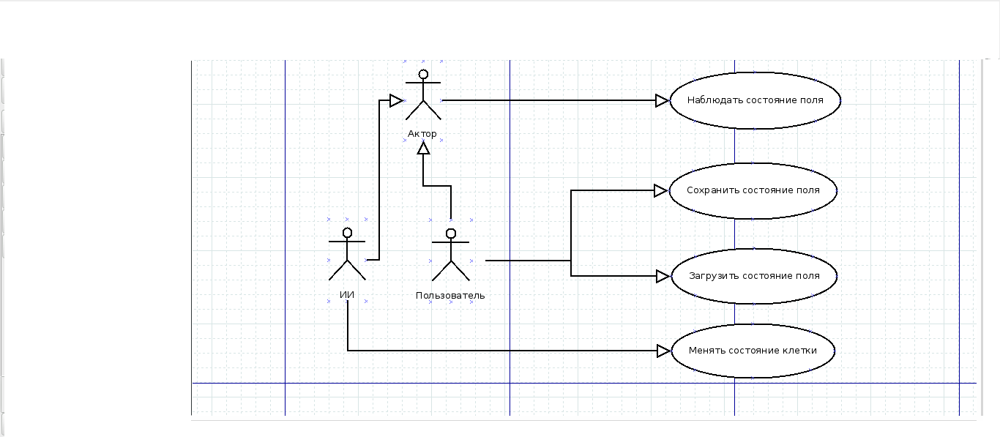

# Жизнь

## Задание
Жизнь. Из файла считывается прямоугольное поле, каждая клетка которого либо жива, либо мертва. В очередном поколении, мертвая клетка становится живой, если она имела ровно трех живых соседей, в противном случае остается мертвой. Живая клетка остается живой, если она имела двух или трех живых соседей, в противном случае становится мертвой. Реализовать на экране процесс смены поколений. Программа должна позволять сохранять вид игрового поля для использования его в будущем.

В редакторе последовательно сменяются поколения. Программа проверяет у каждой клетки состояния всех соседних клеток. Если у мёртвой клетки три живых соседа, то клетка поменяет свой статус на живой, иначе останется мёртвой. То же самое происходит и у живой клетки, она остаётся живой если два или три соседа живые, иначе становится мёртвой. Ещё одним принципиальным правилом является наличие функции сохранения в файл и загрузки из файла поля с зафиксированным состояние всех клеток.

## Концепция (vision statement)
Готовый проект должен моделировать превращение живых клеток в мёртвые и наоборот. Эти превращения проходят по определённым правилам. Пользователь должен иметь возможность наблюдать за текущим состоянием поля и превращением клеток. Также важной функцией программы является возможность сохранить текущее состояние поля в файл и загрузка поля из файла. 

## Минимально работоспособный продукт (Minimum viable product)
Минимально работоспособный продукт должен уметь: предоставить пользователю информацию о текущем состоянии клеток, сохранение и загрузка поля в файл.

## Диаграмма прецедентов использования

## Диаграмма последовательностей

## Диаграмма компонентов
